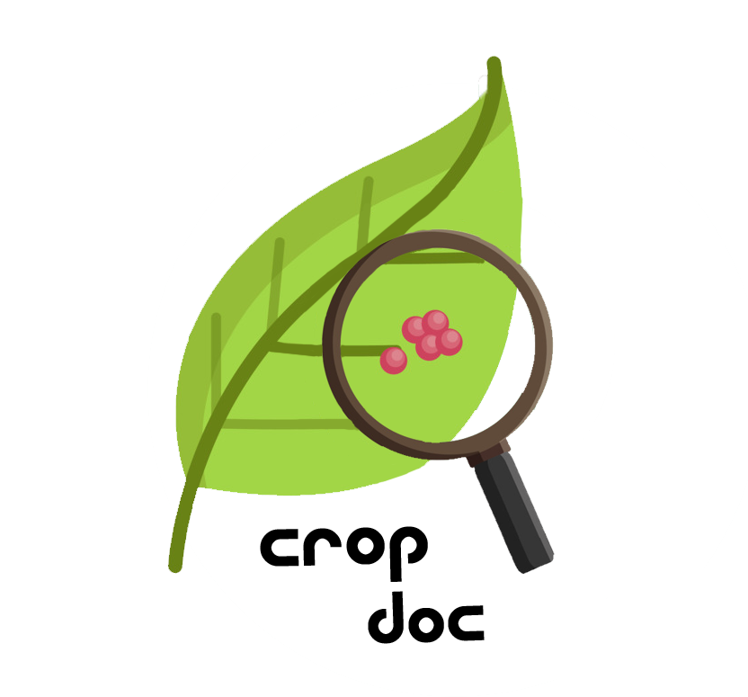

# CropDoc
## Google Summer of Code 2021
### Introduction to the project

CropDoc is a Computer Vision based project that aims to help companies, competent authorities and agricultural professionals overall to detect some diseases on crops by inferring through a Deep Learning model, fed with vegetal images. The application allows the capture of such images, the display of the model results after inferring on them and displaying of this results on the Liquid Galaxy visualization system.


<p align="center">


CropDoc has been developed as part of the Google Summer of Code 2021 program for the Liquig Galaxy organization.
</p>

## Repository structure
- **Main branch:** this is the development branch, designed to be launched on a personal computer, tested on a 64-bit Ubuntu 20.04 LTS OS.
- **Jetson branch:** this is the testing branch, designed to be launched on jetson board, tested on a NVIDIA Jetson Nano 2GB Developer Kit board with a Raspberry Pi v2.1 camera.

The main differences on the code of this two branches reside on the way that the camera video feed is provided. The final Liquid Galaxy demo is only on the jetson branch.

## Installation guide
**This guide corresponds to the installation of the project on a jetson nano developer board, if you are installing on a regular computer, change to main branch.**

### Installation guidelines

Installing on the jetson nano is way more complicated and no virtual environments have been used, to avoid possible problems related to packages scopes. Using at least a 32GB SD card is recommended, for performance purposes.

The toughest part of the installation is installing Tensorflow for jetson Nano, you can check the process here: <a href="https://docs.nvidia.com/deeplearning/frameworks/install-tf-jetson-platform/index.html"> Tensorflow installation</a>. This project is compatible with the latest version of tensorflow for the jetson platform (2.5.1).

Once tensorflow is correcly installed, you need to install the rest of dependencies using pip. Package depencies include: opencv, pandas, numpy, pillow, pykml, flask and flask cors.

There's no need to create a virtual environment for this setup, I personally choosed to install it directly on the root scope since I was the only developer using that board. 

**Important:** I recommend not installing OS updates or upgrading the system, that crashed my installation and I was unable to boot the jetson board anymmore, I had to start from scratch on a new board.

### Running the flask server

You can start the flask server navigating to cropDoc/flaskApp/ and then running:
```
python3 app.py
```

After shuting down the flask server, make sure to reset the camera daemon, since the video stream can't be properly released when closing the server abruptly with `Ctrl + C`.

To reset the camera daemon:
```
sudo systemctl restart nvargus-daemon
```

If you are trying to run the demo on the LG for the first time, you must first run the `setMasterFiles.py` script, to create the proper folder on the LG system. You don't need to do this for each run afterwards.

## User's guide

For a detailed guide on the application interface, check out to the <a href="https://docs.google.com/document/d/1RHgmzBhTpD430F9Gk1A2d4GYNM8XBVVeYidUIxgw6Fw/edit?usp=sharing">user's guide</a>.

## Built with

- **Deep Learning model:** Tensorflow, TensorflowLite, OpenCV, Scikit-learn, Pandas, NumPy, training done at Kaggle.
- **Liquig Galaxy interaction:** Pillow, pyKML. 
- **BackEnd:** Flask, Python 3.
- **FrontEnd:** HTML, CSS, JavaScript
- **Hardware:** NVIDIA Jetson Nano 2GB Developer Kit, Raspberry Pi v2.1 camera.

## Project Structure
```
────cropDoc
    │   .gitignore
    |   requirements_conda.txt
    |   requirements_pip.txt
    |   README.md
    └───flaskApp
        |   app.py
        ├───model
        |   predictions.py
        |   utils.py
        |   model.tflite
        ├───parser
        |   app.conf
        |   ConfigurationFile.py
        |   GenerateKml.py
        |   global_vars.py
        |   kml_utils.py
        |   parser.py
        |   setMasterFiles.py
        |   utils.py
        ├───static
        |   ├───css
        |   |   style.css
        |   ├───images
        |   |   stats.png
        |   |   ...
        |   ├───js
        |   |   main.js
        |   |   prediction.js
        |   ├───kml
        |   |   field.kml
        |   |   orbit.kml
        |   |   slave_3.kml
        |   ├───logos
        |   |   Logos.png
        |   |   ...
        |   └───xls
        |       demo_data.xlsx
        └───templates
            index.html
            prediction.html
```
## Files description

- **requirements_conda:** required packages for a conda virtual environment.
- **requirements_pip.txt:** alternatively, required packages for a pip virtual environment.
- **flaskApp/app.py** flask server implementation.
- **flaskApp/model/predictions.py** functions to perform inferrence with the model, as well as to process the resulting probabilities.
- **flaskApp/model/utils.py** utilities to prepare the model usage.
- **flaskApp/model/model.tflite** tensorflowLite compressed model, to fit inside the jetson board limited memmory. You can check how this model was developed at my <a href="https://www.kaggle.com/guillemfelis/plant-pathology-2021">kaggle notebook.</a>
- **flaskApp/parser/app.conf** defined values for the global variables.
- **flaskApp/parser/ConfigurationFile.py** parser to load the values of the global variables.
- **flaskApp/parser/GenerateKML.py** functions to generate the KML files that will be sent to the Liquid Galaxy.
- **flaskApp/parser/global_vars.py** container for the loaded values of the global variables.
- **flaskApp/parser/kml_utils.py** functions to interact with the Liquid Galaxy.
- **flaskApp/parser/parser.py** functions to parse the data from the .xlsx files.
- **flaskApp/parser/setMasterFiles.py** used on a fresh run, to setup the Liquid Galaxy folder for the project.
- **flaskApp/parser/utils.py** data object class, used by the <span>parser</span>.py to represent the information about each field.
- **flaskApp/static/css/style.cs** style definition for the frontEnd.
- **flaskApp/static/images/** images used on the frontEnd interface.
- **flaskApp/static/images/stats.png** image sent to the Liquid Galaxy to show statistics of each field, auto-generated and overwritten for each field.
- **flaskApp/static/js/main.js** button scripts for the base page at /.
- **flaskApp/static/js/predictions.js** button scripts for the /predict page.
- **flaskApp/static/kml/field.kml** auto-generated and overwritten for each field, contains pins and polygons details.
- **flaskApp/static/kml/orbit.kml** auto-generated and overwritten for each field, simulates an orbit movement.
- **flaskApp/static/kml/slave_3.kml** displays the logos on the right most screen for a 5 screens LG system.
- **flaskApp/static/logos/Logos.png** imaged used to display logos on the LG system.
- **flaskApp/static/shots/** generated only locally, directory where the taken photos are stored.
- **flaskApp/static/xls/demo_data.xlsx** contains the coordinates of the polygons and locations to be displayed on the LG.
- **flaskApp/templates/index.html** structure for the frontEnd's base page.
- **flaskApp/templates/prediction.html** structure for the /prediction page.
